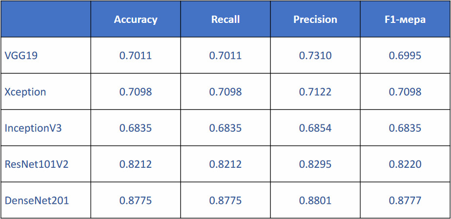

# neural-SER

This is master's thesis - speech emotion recognition using convolutional neural networks

## Task description

Recognize neutral emotion and Ekman's six basic emotions:

- anger
- disgust
- fear
- happiness
- sadness
- surprise

Calculate classification accuracy metrics:

- accuracy
- precision
- recall
- f1-score

## Solution

`preprocess_data.ipynb` - compiling csv tables with paths to files and emotions

`modeling.ipynb` - training models, visualizing training history, calculating metrics, checking model training on a test set

Used convolutional neural network models:

- VGG19
- Xception
- InceptionV3
- ResNet101V2
- DenseNet201

Used datasets:

- [Toronto emotional speech set (TESS)](https://www.kaggle.com/datasets/ejlok1/toronto-emotional-speech-set-tess)
- [Surrey Audio-Visual Expressed Emotion (SAVEE)](https://www.kaggle.com/datasets/ejlok1/surrey-audiovisual-expressed-emotion-savee)
- [Ryerson Audio-Visual Database of Emotional Speech and Song (RAVDESS)](https://www.kaggle.com/datasets/uwrfkaggler/ravdess-emotional-speech-audio)
- [Crowd Sourced Emotional Multimodal Actors Dataset (CREMA-D)](https://www.kaggle.com/datasets/ejlok1/cremad)

## Results

### Combined dataset

|  |
|:------------------------------------------------------------:|
|           _Number of emotions in combined dataset_           |

### Models training

Using the Xception model as an example for results:

|                                      |
|:-------------------------------------------------------------------------------------------------:|
| _Xception loss function for training and validation data of combined dataset vs number of epochs_ |

|                                                 |
|:--------------------------------------------------------------------------------------------------:|
| _Xception model accuracy for training and validation data of combined dataset vs number of epochs_ |

|  |
|:----------------------------------------------------------:|
|        _Confusion matrix for trained Xception model_       |

### Results tables

|  |
|:---------------------------------------:|
|           _Calculated metrics_          |

|  |
|:----------------------------------------------------------:|
|            _Accuracy for each emotion and model_           |